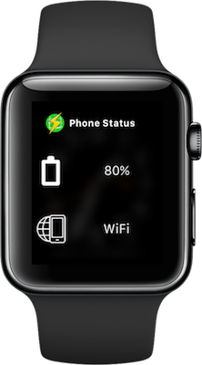

# Phone Status Glance

A quick and simple iOS app to show your phone's battery and network connection state on your watch.

## Installation

Phone Status Glance is available free from the App Store for iOS 9 and above.

## Certificates and Profiles

Phone Status Glance is configured to use [Match](https://github.com/fastlane/fastlane/tree/master/match) to manage code signing certificates and profiles. You can specify your own repo for managing your certificates with the `FASTLANE_MATCH_REPO` environment variable.

## Usage

Once installed on your iOS device, you need to install the Phone Status Glance app on your watch. For best results, the glance should also be installed.

Open the Phone Status Glance iOS app, and follow the instructions to get set up.

